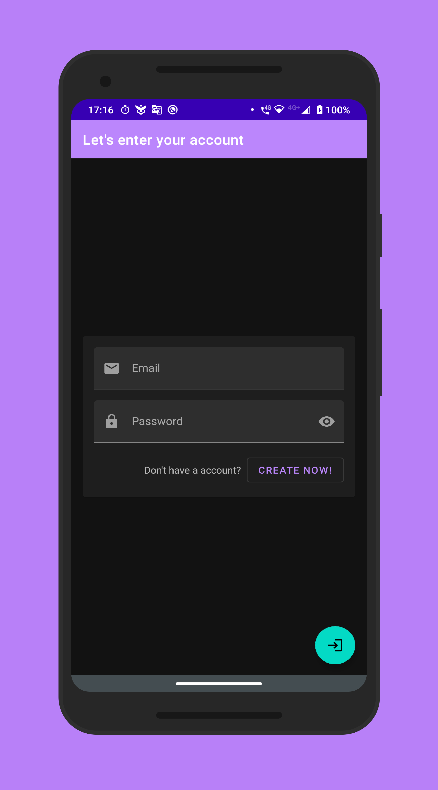

# Pop Thrift Store Project

## Project Overview

Pop Thrift Store app is the first project in the Android Kotlin Nanodegree Program from Udacity, it showcases a digital a store that sells used things such as clothes, books, and furniture.

<!--
## Why this Project

Building a layout and populating its fields from data received as JSON
is a common task for Android Developers. Although JSON parsing is usually
done using libraries, writing the JSON parsing for  this project will
help the developer to better understand how it is processed.

## What Will Developer Learn?

Through this project, developer will:
- Learn how to submit projects for review
- Practice JSON parsing to a model object
- Design an activity layout
- Populate all fields in the layout accordingly

## Project Specification

### Common Project Requirements

| CRITERIA       | MEETS SPECIFICATIONS |
| :------------- | :---------- |
| App is written solely in the Java Programming Language | App is written solely in the Java Programming Language |
| App conforms to common standards found in the [Android Nanodegree General Project Guidelines](http://udacity.github.io/android-nanodegree-guidelines/core.html) NOTE: It is okay if the app does not handle rotation properly or does not restore the data using `onSaveInstanceState/onRestoreInstanceState`) | App conforms to common standards found in the Android Nanodegree General Project Guidelines NOTE: It is okay if the app does not handle rotation properly or does not restore the data using `onSaveInstanceState/onRestoreInstanceState`) |
| Submission must use stable release versions of all libraries, Gradle, and Android Studio. Debug/beta/canary versions are not acceptable. | App utilizes stable release versions of all libraries, Gradle, and Android Studio. |

### Core Functionality

| CRITERIA       | MEETS SPECIFICATIONS |
| :------------- | :---------- |
| JSON data is parsed correctly to a Sandwich object in JsonUtils | JSON data is parsed correctly to a Sandwich object in JsonUtils |
| JSON is parsed without using 3rd party libraries | JSON is parsed without using 3rd party libraries |
| DetailActivity shows all Sandwich details correctly | DetailActivity shows all Sandwich details correctly |
| Detail layout includes a ScrollView so all the details are visible in small screen devices | Detail layout includes a ScrollView so all the details are visible in small screen devices |
| Sandwich details are shown in a sensible layout. For example, ingredients appear next to the ingredients label | Sandwich details are shown in a sensible layout. For example, ingredients appear next to the ingredients label |

## Showcase

    
    

    
    

## Live Running

-->
