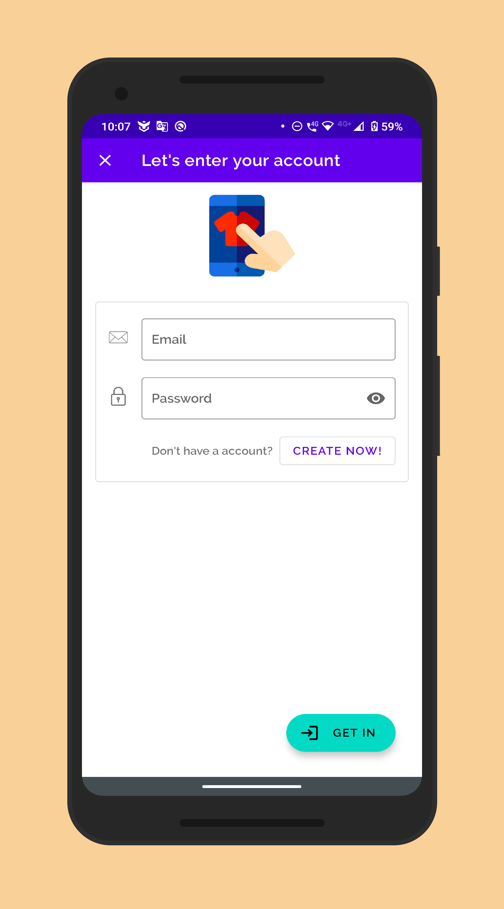
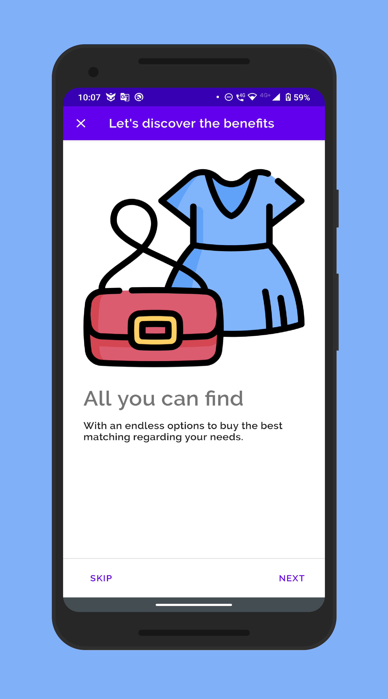
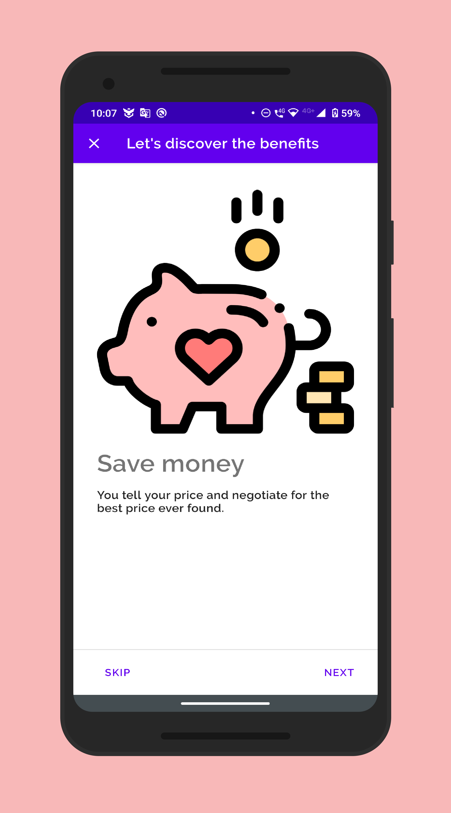
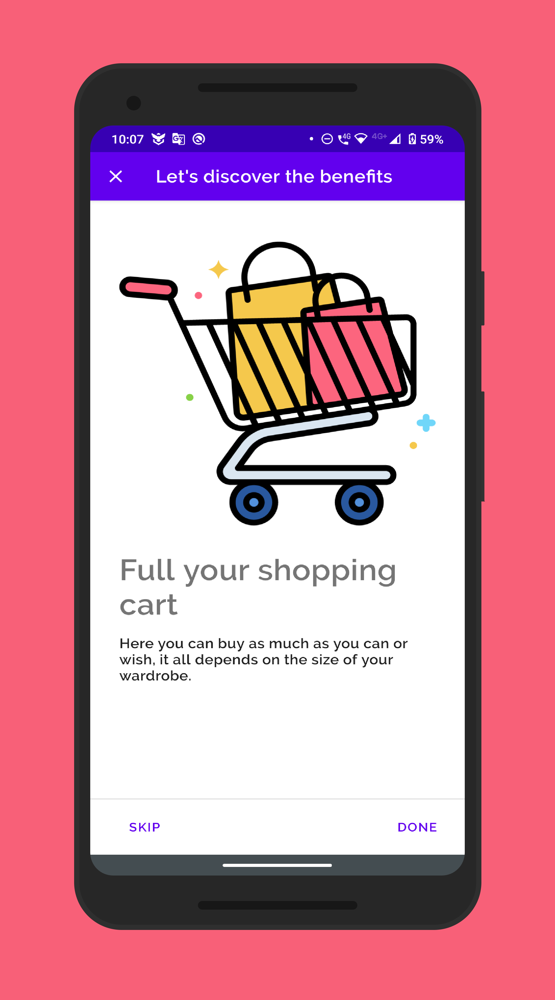
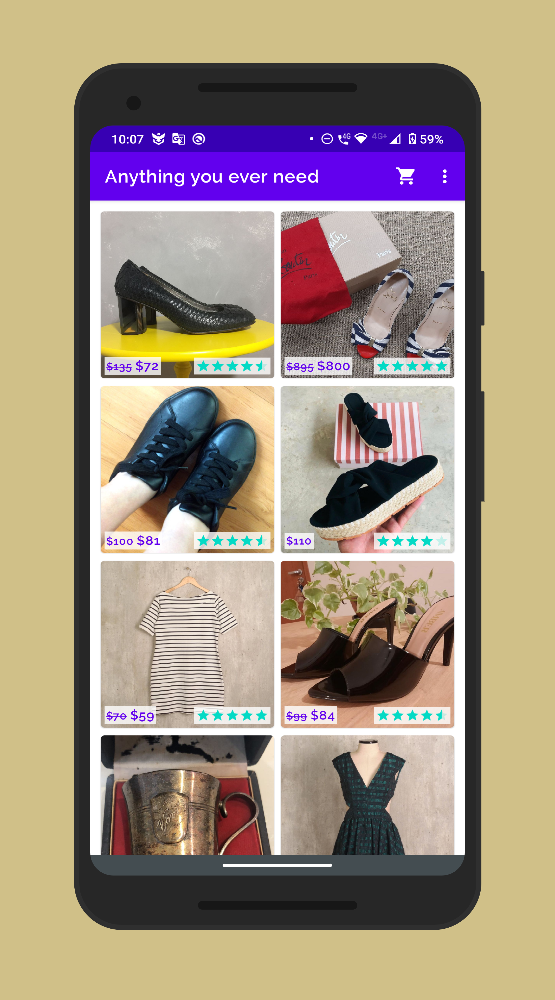

# Pop Thrift Store Project

## Project Overview

Pop Thrift Store app is the first project in the Android Kotlin Nanodegree Program from Udacity, it showcases a digital a store that sells used things such as clothes, books, and furniture.

<!--
## Why this Project

Building a layout and populating its fields from data received as JSON
is a common task for Android Developers. Although JSON parsing is usually
done using libraries, writing the JSON parsing for  this project will
help the developer to better understand how it is processed.

## What Will Developer Learn?

Through this project, developer will:
- Learn how to submit projects for review
- Practice JSON parsing to a model object
- Design an activity layout
- Populate all fields in the layout accordingly
-->

## Project Specification

### Common Project Requirements

| CRITERIA       | MEETS SPECIFICATIONS |
| :------------- | :---------- |
| App is written solely in the Java Programming Language | App is written solely in the Java Programming Language |
| App conforms to common standards found in the [Android Nanodegree General Project Guidelines](http://udacity.github.io/android-nanodegree-guidelines/core.html) NOTE: It is okay if the app does not handle rotation properly or does not restore the data using `onSaveInstanceState/onRestoreInstanceState`) | App conforms to common standards found in the Android Nanodegree General Project Guidelines NOTE: It is okay if the app does not handle rotation properly or does not restore the data using `onSaveInstanceState/onRestoreInstanceState`) |
| Submission must use stable release versions of all libraries, Gradle, and Android Studio. Debug/beta/canary versions are not acceptable. | App utilizes stable release versions of all libraries, Gradle, and Android Studio. |

### Code Quality

| CRITERIA       | MEETS SPECIFICATIONS |
| :------------- | :---------- |
| Correctly use ViewModel and LiveData lifecycle classes in an Android app | The Detail screen needs to add the new item to the view model. The listing screen should be listening to that model and show the new item. |
| Correctly implement Single Activity architecture | There should only be one activity: MainActivity. Each screen should be a fragment. |
| Write error-free code | The project's code is error-free. |

### Layouts

| CRITERIA       | MEETS SPECIFICATIONS |
| :------------- | :---------- |
| Create layouts using the correct ViewGroups and Views in an Android app. | The project correctly implements LinearLayout and ConstraintLayout to match the complexity of the layout of a page. Using code comments, the project justifies the use of ConstraintLayout or LinearLayout |
| Apply Databinding in Layouts to show the correct data to users in multiple layouts. | <ol><li>All layouts will use the `<layout>` tag to support Databinding.</li><li>Detail screen uses the `<data>` element.</li><li>Databinding is set to the appropriate setting in the app build.gradle file</li> |
| Correctly use the `<data>` and `<variable>` elements within the layout. | The detail layout contains an <data> element with the name of the variable and the class associated with it. <ul><li>All EditViews correctly refer to created class variable</li></ul> |
| Create a multi-screened Android Application using Android widgets. | <ul><li>The app contains at least 5 screens.</li><li>The app contains correctly laid-out labels and edit fields for each screen.</li><li>The app contains button positioned below the text fields</li></ul> |
| List screen uses ScrollView and LinearLayout for showing a list of items and one Floating Action button for going to the detail screen. Creates a layout for the item. | <ol><li>A new item layout is created for each item</li><li>New item layout is added to LinearLayout</li><li>Layout is updated with items added on the detail screen</li></ol> |
| Create a detail screen that shows two columns of labels and edit views to enter in a new item. | <ol><li>Layout created with a label & edit view for each item</li><li>Uses data binding to save data</li><li>Uses a save button to save data to view model</li></ol> |

### Navigation

| CRITERIA       | MEETS SPECIFICATIONS |
| :------------- | :---------- |
| Create a navigation file that correctly takes a user from one page to the next in an Android app | The app needs to traverse the following screens in the correct order: <ul><li>Login</li><li>Welcome</li><li>Instructions screen</li><li>Listing screen</li><li>Detail screens The app should also be able to navigate back via the back arrow or the back button.</li><li>A navigation file has been created that defines a start destination.</li><li>All destinations have a fragment, label and action associated with it.</li></ul> |
| Use Databinding for click listeners on a navigation screen in an Android app. | <ol><li>All code will use the DataBindingUtil class to inflate the layout.</li><li>All click listeners are connected via the DataBindingUtil class and uses the NavController to navigate to the next screen.</li></ol> |
| Create a Logout menu to return to the Login screen. | This menu will appear only on the Shoe Listing screen and will return the user to the login screen |

## Showcase

    
    
    
    
    
    

## Live Running

